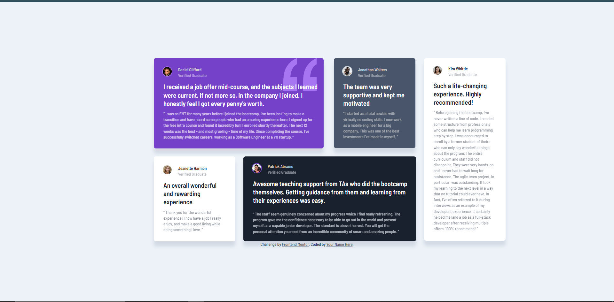

# Frontend Mentor - Testimonials grid section solution

This is a solution to the [Testimonials grid section challenge on Frontend Mentor](https://www.frontendmentor.io/challenges/testimonials-grid-section-Nnw6J7Un7). Frontend Mentor challenges help you improve your coding skills by building realistic projects. 

## Table of contents

- [Overview](#overview)
  - [The challenge](#the-challenge)
  - [Screenshot](#screenshot)
  - [Links](#links)
- [My process](#my-process)
  - [Built with](#built-with)
  - [What I learned](#what-i-learned)
  - [Continued development](#continued-development)
  - [Useful resources](#useful-resources)
- [Author](#author)
- [Acknowledgments](#acknowledgments)

## Overview

### The challenge

Users should be able to:

- View the optimal layout for the site depending on their device's screen size

### Screenshot

### Links

- Solution URL: [Github](https://github.com/laceeder/testimonials-grid-section)
- Live Site URL: [Vercel](https://testimonials-grid-section-lemon.vercel.app/)

## My process

### Built with

- Semantic HTML5 markup
- CSS custom properties
- Flexbox
- CSS Grid
- Mobile-first workflow

### What I learned

I learned how to use more CSS Grid properties, more about the fr unit, and how to create a multi-column/row style layout.

### Continued development

I want to continue to explore CSS grid properties and creating multi-column/row layouts.

### Useful resources

- [CSS Tricks - Gap](https://css-tricks.com/almanac/properties/g/gap/) - This article broke down the process of how the "gap" property works in a way I was able to visualize it and understand.
- [w3schools - Grid](https://www.w3schools.com/css/css_grid.asp) - I great article for breaking down how the CSS Grid property works and all of it's components. Great resource!

## Author

- Frontend Mentor - [@laceeder](https://www.frontendmentor.io/profile/laceeder)
- Github - [@laceeder](https://github.com/laceeder)